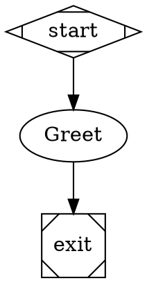

# Fabro Cloud

A cloud-hosted version of [Fabro](https://fabro.sh/) — the dark software factory for orchestrating AI workflow runs. This project provides:

- **Next.js frontend** — Runs board, workflow management, run detail with live events
- **API proxy** — Forwards requests from `/api/fabro/*` to your Fabro backend
- **Fabro backend** — Pre-built Docker image for Cloud Run

## Architecture

```
[Browser] → [Next.js (Firebase App Hosting)] → [Fabro API (Cloud Run)]
```

The Next.js app proxies all Fabro API calls to a separately deployed Fabro backend.

## Quick Start

### 1. Local development (demo mode)

The Fabro **API server** (`fabro serve`) is in [private early access](https://docs.fabro.sh/administration/deploy-server) and is not included in the open source release. For local development, use **demo mode** which shows the UI with static mock data:

```bash
cp .env.example .env.local
# Add: NEXT_PUBLIC_FABRO_DEMO=1
npm run dev
```

Open [http://localhost:3000](http://localhost:3000).

### With a Fabro backend

If you have access to a Fabro server (private early access or self-hosted):

```bash
# Set FABRO_API_URL to your Fabro server, e.g. http://127.0.0.1:3001
npm run dev
```

The Docker image (`docker compose up fabro`) and Cloud Run deployment target the server build; the open source CLI does not include `serve`.

### 2. Demo mode (no Fabro backend required)

```bash
# In .env.local:
NEXT_PUBLIC_FABRO_DEMO=1
# Leave FABRO_API_URL unset or use any URL - demo mode returns static mock data
npm run dev
```

### 3. Deploy to Google Cloud

**Deploy Fabro backend to Cloud Run:**

```bash
gcloud builds submit --config=cloudbuild-fabro.yaml .
```

Note the Cloud Run URL (e.g. `https://fabro-backend-xxx-uc.a.run.app`).

**Deploy Next.js to Firebase App Hosting:**

1. Set `FABRO_API_URL` in Firebase Console to your Fabro Cloud Run URL
2. Deploy via Firebase CLI or GitHub integration

## Project structure

- `app/` — Next.js App Router pages and API routes
- `app/api/fabro/[[...path]]/` — Proxy to Fabro backend
- `lib/fabro-api.ts` — API client for the frontend
- `fabro-backend/` — Dockerfile for the Fabro binary
- `cloudbuild-fabro.yaml` — Cloud Build config for Fabro backend

## Environment variables

| Variable | Description |
|----------|-------------|
| `FABRO_API_URL` | Fabro backend URL (required for real workflows) |
| `NEXT_PUBLIC_FABRO_DEMO` | Set to `1` for demo mode with static mock data |

## Workflow format

Fabro workflows use [Graphviz DOT](https://docs.fabro.sh/core-concepts/workflows). Example:



See [Fabro workflow docs](https://docs.fabro.sh/core-concepts/workflows) for the full reference.
