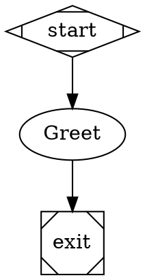

# Fabro Cloud

A cloud-hosted workflow orchestration platform inspired by [Fabro](https://fabro.sh/) — the dark software factory. Built with Next.js and a native TypeScript workflow engine.

## Features

- **Workflow engine** — Parses and executes Graphviz DOT workflows (Fabro-compatible format)
- **Agent nodes** — LLM calls via Anthropic Claude
- **Command nodes** — Shell script execution
- **Runs board** — List, start, and monitor workflow runs
- **Event streaming** — SSE for real-time run updates

## Architecture

```
[Browser] → [Next.js (Firebase App Hosting)]
                  ↓
            [Workflow Engine]
                  ↓
            [Anthropic API]
```

No external Fabro backend — the workflow engine runs inside the Next.js app.

## Quick Start

```bash
cp .env.example .env.local
npm run dev
```

Open [http://localhost:3000](http://localhost:3000).

**Optional:** Set `ANTHROPIC_API_KEY` in `.env.local` for real LLM calls. Without it, agent nodes return mock responses.

## Deploy to Firebase

See [Firebase App Hosting](https://firebase.google.com/docs/app-hosting):

```bash
firebase apphosting:backends:create --project fabro-cloud
```

Set `ANTHROPIC_API_KEY` in Firebase Console → App Hosting → Settings → Environment.

## Project structure

- `app/` — Next.js App Router pages and API routes
- `app/api/fabro/[[...path]]/` — Workflow API (runs, events)
- `lib/workflow/` — Parser, engine, store, LLM client
- `lib/fabro-api.ts` — Frontend API client

## Environment variables

| Variable | Description |
|----------|-------------|
| `ANTHROPIC_API_KEY` | Anthropic API key for Claude (agent/prompt nodes) |

## Workflow format

Workflows use [Graphviz DOT](https://docs.fabro.sh/core-concepts/workflows):



**Node types:**
- `Mdiamond` — Start
- `Msquare` — Exit
- `box` — Agent (multi-turn LLM)
- `tab` — Prompt (single LLM call)
- `parallelogram` — Command (shell script)

See [Fabro workflow docs](https://docs.fabro.sh/core-concepts/workflows) for the full reference.
